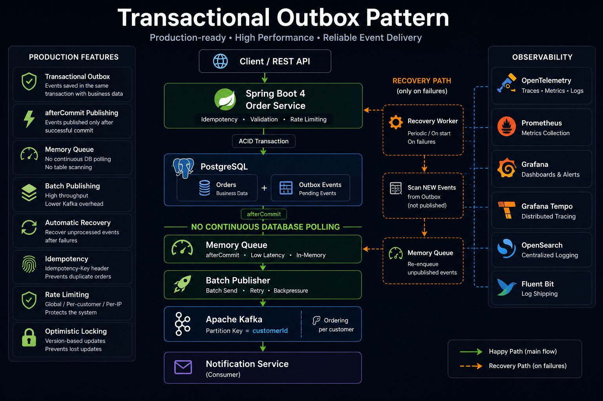
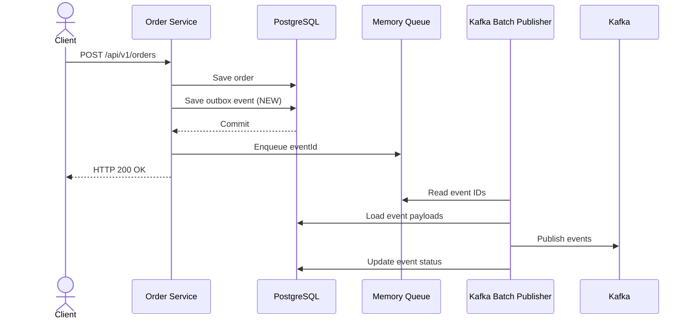
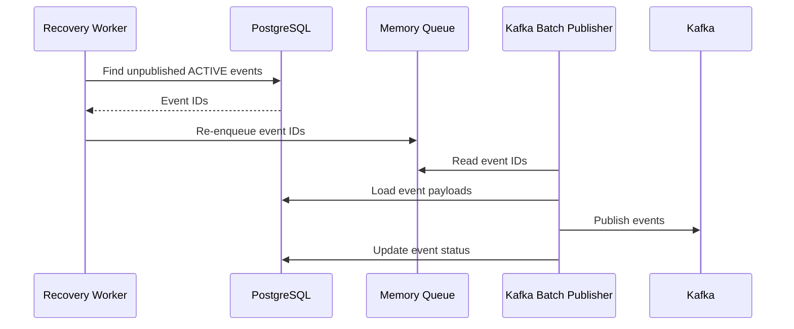
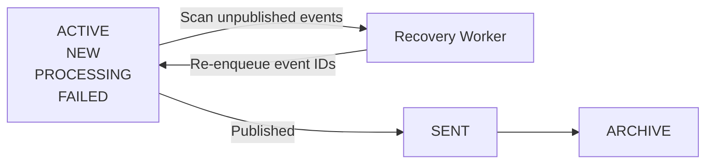
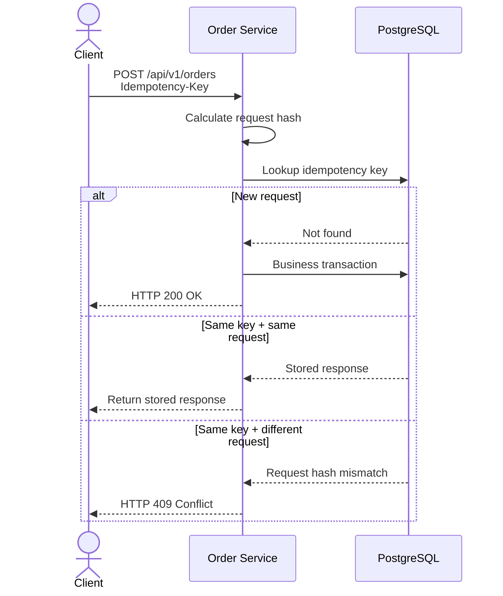
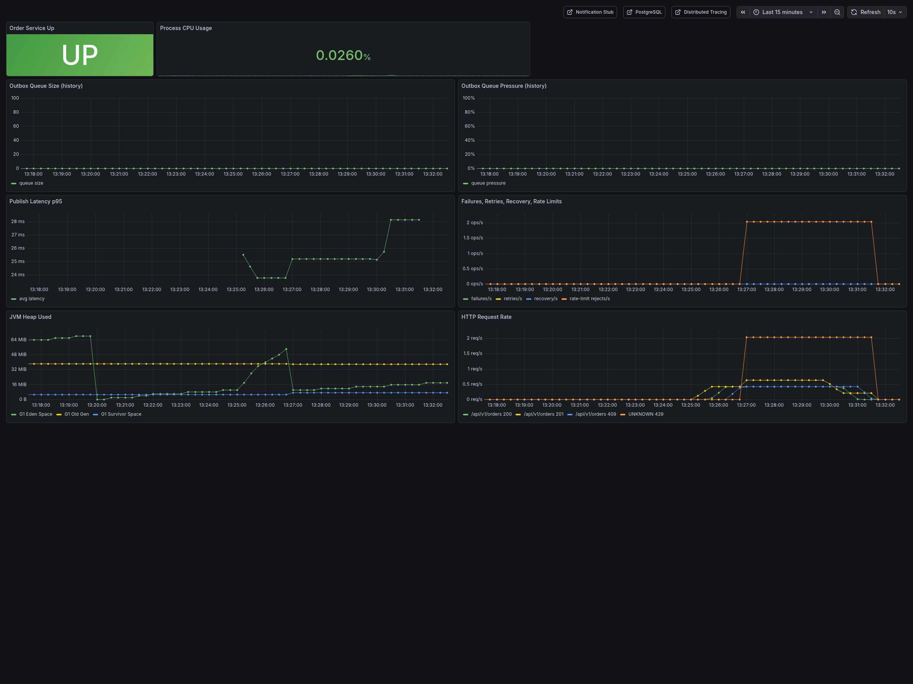
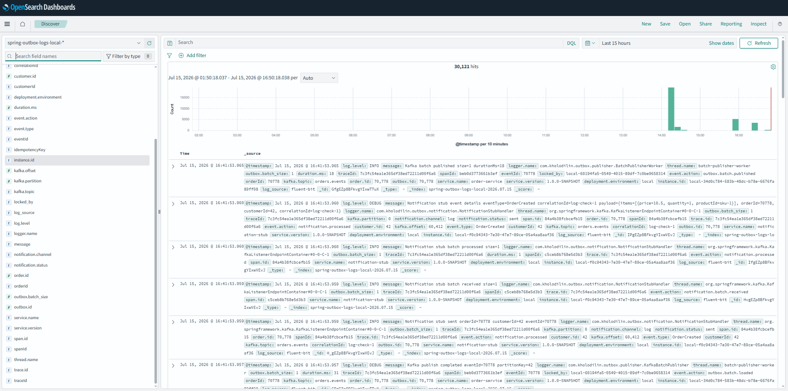
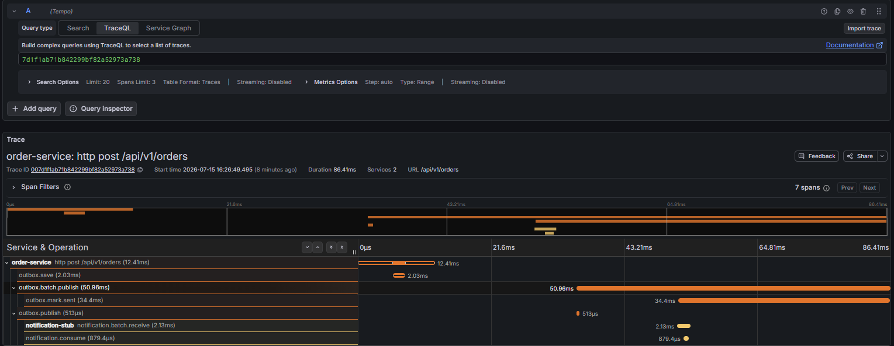

# Transactional Outbox Pattern with Kafka and PostgreSQL

[](https://github.com/KHolodilin/spring-transactional-outbox-kafka/actions/workflows/ci.yml)
[](https://codecov.io/gh/KHolodilin/spring-transactional-outbox-kafka)
[](https://openjdk.org/)
[](https://spring.io/projects/spring-boot)
[](LICENSE)
[](https://kafka.apache.org/)
[](https://www.postgresql.org/)
[](https://opensearch.org/)
[](https://grafana.com/)

Production-oriented **Transactional Outbox** for Spring Boot 4, PostgreSQL, and Kafka, combining low-latency event delivery, durable recovery, and reduced database polling.
<p align="center">
  <a href="docs/images/hero-architecture.png">
    
  </a>
</p>

## 💡 Why this project?

There are several well-established ways to implement the Transactional Outbox pattern. Each approach solves the same reliability problem, but with different trade-offs in latency, operational complexity, infrastructure, and database load.

This project targets teams already using **Spring Boot, PostgreSQL, and Kafka** that want low-latency event delivery without continuous database polling or an additional CDC platform.

### ⚖️ Comparison

| Approach | ✅ Pros | ⚠️ Cons |
|----------|----------|----------|
| **Database Polling** | ✅ Simple to understand<br>✅ Works with almost any relational database<br>✅ Easy to implement | ❌ Continuously polls the database<br>❌ Additional latency between commit and publishing<br>❌ Database load grows with polling frequency |
| **PostgreSQL LISTEN / NOTIFY** | ✅ Near real-time notifications<br>✅ Built into PostgreSQL<br>✅ No polling during normal operation | ⚠️ Notifications are not durable<br>⚠️ Recovery scanning is still required after failures<br>⚠️ PostgreSQL-specific solution |
| **Debezium (CDC)** | ✅ Reliable Change Data Capture<br>✅ No application polling<br>✅ Excellent for large event-driven platforms | ❌ Requires Kafka Connect and Debezium infrastructure<br>❌ Higher operational complexity<br>❌ Event publishing is managed outside the application |
| **Memory Queue + Recovery (this project)** | ✅ No continuous database polling during normal operation<br>✅ Single publishing pipeline for normal and recovery flows<br>✅ PostgreSQL remains the durable source of truth<br>✅ Recovery scans only unpublished events in the ACTIVE partition | ⚠️ Requires an in-memory queue per application instance<br>⚠️ Recovery worker is still required after unexpected failures |

### 🎯 Why this approach?

Instead of using PostgreSQL as both a database and a message queue, this project separates those responsibilities.

- **PostgreSQL** provides durable event storage.
- **Memory Queue** delivers events with minimal latency.
- **Recovery Worker** restores events after failures.
- **Kafka Batch Publisher** is shared by both the normal and recovery paths.

During normal operation, the application never continuously polls the database for new events.

After a transaction commits, the event identifier is immediately placed into the in-memory queue. If the application crashes or the queue cannot process the event, the recovery worker scans only the **ACTIVE** partition, re-enqueues unpublished events, and sends them through the **same publishing pipeline**.

The result is a solution that provides:

- ✅ Low-latency event delivery
- ✅ Minimal PostgreSQL load during normal operation
- ✅ Constant recovery scan cost using Active / Archive partitioning
- ✅ A single, consistent publishing pipeline
- ✅ Production-ready observability with metrics, structured logging, and distributed tracing

## 🔄 How it works

The project is built around three core workflows:

1. **Normal Flow** — processes newly created outbox events with minimal latency.
2. **Recovery Flow** — restores unpublished events after crashes or temporary failures.
3. **Idempotent Request Flow** — prevents duplicate order creation and duplicate outbox events.

The **Normal Flow** and **Recovery Flow** converge into the same publishing pipeline, sharing the Memory Queue and Kafka Batch Publisher.

### ✅ Normal Flow



The business transaction stores the order, the outbox event, and the idempotency record in a single database transaction.

After the transaction commits, only the **event ID** is placed into the Memory Queue. The publisher reads event IDs in batches, loads the corresponding payloads from PostgreSQL, publishes them to Kafka, and updates the event status.

During normal operation, the application does not continuously poll PostgreSQL for new events.

### 🔁 Recovery Flow



If an event is committed but is not processed through the normal flow, it remains safely stored in PostgreSQL.

The Recovery Worker periodically scans unpublished events from the **ACTIVE** partition and places their IDs back into the Memory Queue.

> **One Publishing Pipeline**
>
> Recovery never publishes events directly. Both the Normal Flow and Recovery Flow use the same Memory Queue, batch loading logic, Kafka Batch Publisher, and event status update process.
>
> This eliminates duplicate publishing logic and keeps the behavior consistent across normal operation and recovery.

### 📦 Why Active / Archive?



Only unpublished events remain in the **ACTIVE** partition.

Once an event is successfully published, it is moved to the **ARCHIVE** partition and is never scanned by the Recovery Worker again.

As a result, recovery performance depends only on the number of active events instead of the total history stored in the outbox table.

### 🔑 Idempotent Request Flow



Each request is uniquely identified by the combination of **customerId** and **Idempotency-Key**.

For a new request, the service executes the business transaction and stores the response. If the same request is received again with an identical payload, the stored response is returned immediately. If the payload differs, the request is rejected with **HTTP 409 Conflict**.

## 🔭 Observability

The project includes production-ready observability out of the box, providing complete visibility into the event delivery pipeline.

By combining **metrics**, **structured logging**, and **distributed tracing**, you can quickly understand system behavior, investigate failures, and troubleshoot performance issues.

### 📊 Metrics

*Powered by **Prometheus** and **Grafana***.

Monitor application health, queue utilization, publishing latency, retry activity, recovery operations, and standard Spring Boot, JVM, and PostgreSQL metrics.

**Grafana Dashboard**



*Monitor queue utilization, publishing latency, recovery activity, JVM health, and application performance in real time.*

In addition to standard metrics, the project exposes custom metrics for the Transactional Outbox pipeline.

| Metric | Description |
|---------|-------------|
| `outbox.queue.size` | Current Memory Queue size |
| `outbox.queue.pressure` | Memory Queue utilization ratio |
| `outbox.publish.latency` | Kafka publishing latency |
| `outbox.publish.failures` | Number of failed publish attempts |
| `outbox.retry.count` | Publisher retry count |
| `outbox.recovery.count` | Events restored by the Recovery Worker |
| `outbox.rate_limit.rejects` | HTTP 429 responses |

### 🔍 Structured Logging

*Powered by **Fluent Bit** and **OpenSearch***.

All services produce structured JSON logs, making it easy to investigate failures and trace business operations across the system.

**OpenSearch Dashboards**



*Search requests, investigate failures, and correlate business events using structured log fields.*

Every log entry includes searchable business and tracing identifiers:

- `correlationId`
- `customerId`
- `idempotencyKey`
- `traceId`
- `eventId`
- `instanceId`

The project also provides preconfigured dashboards and useful saved queries.

| Query | Purpose |
|---------|-------------|
| Logs by `customerId` | View the complete processing history for a customer |
| Logs by `correlationId` | Trace a single request across all services |
| Outbox publish failures | Investigate failed Kafka publishing |
| Rate limit rejected | Find HTTP 429 responses |

### 🔗 Distributed Tracing

*Powered by **OpenTelemetry** and **Grafana Tempo***.

Follow every request across the complete processing pipeline—from the REST API through the business transaction and Kafka publishing to downstream services.

**Grafana Tempo Trace**



*Visualize the complete lifecycle of a request, identify latency bottlenecks, and understand interactions between application components.*

Distributed tracing helps you:

- Follow requests across service boundaries
- Identify latency bottlenecks
- Understand asynchronous processing
- Correlate traces with logs and metrics

### 🌐 Local Services

After starting the Docker Compose infrastructure, the following services are available:

| Service | URL | Purpose |
|---------|-----|---------|
| Grafana | http://localhost:3000 | Dashboards (`admin / admin`) |
| Prometheus | http://localhost:9090 | Metrics collection |
| Grafana Tempo | http://localhost:3200 | Distributed tracing backend |
| OpenSearch | http://localhost:9200 | Structured log storage |
| OpenSearch Dashboards | http://localhost:5601 | Log search and dashboards |
| PostgreSQL Exporter | http://localhost:9187/metrics | PostgreSQL metrics |

> 💡 **Tip**
>
> After starting the application, create a few orders using the REST API, then open Grafana, OpenSearch Dashboards, and Tempo. Viewing metrics, logs, and traces together is the fastest way to understand how events move through the system.

## 🚀 Quick Start

Run the complete Transactional Outbox example locally and publish your first event in a few minutes.

### 🐳 1. Start the infrastructure

```bash
docker compose up -d
```

Docker Compose starts the required infrastructure:

- PostgreSQL
- Kafka
- Prometheus
- Grafana
- Grafana Tempo
- OpenSearch
- OpenSearch Dashboards
- Fluent Bit
- PostgreSQL Exporter

Check that all containers are running:

```bash
docker compose ps
```

### 🔨 2. Build the project

```bash
mvn clean verify
```

This command compiles all modules and runs the automated test suite.

### ▶️ 3. Start the application services

Run the Order Service:

```bash
mvn -pl order-service spring-boot:run \
  -Dspring-boot.run.profiles=dev
```

In a separate terminal, run the Notification Stub:

```bash
mvn -pl notification-stub spring-boot:run \
  -Dspring-boot.run.profiles=dev
```

The services will be available at:

| Service | URL |
|---------|-----|
| Order Service | http://localhost:8080 |
| Notification Stub | http://localhost:8081 |

### 🛒 4. Create an order

Send a request with a unique `Idempotency-Key`:

```bash
curl -X POST http://localhost:8080/api/v1/orders \
  -H "Content-Type: application/json" \
  -H "Idempotency-Key: 550e8400-e29b-41d4-a716-446655440000" \
  -d '{
    "customerId": 42,
    "items": [
      {
        "productId": "sku-1",
        "quantity": 2,
        "price": 10.50
      }
    ],
    "correlationId": "quick-start-demo"
  }'
```

The request creates:

1. An order
2. An idempotency record
3. A transactional outbox event

All three records are committed in the same PostgreSQL transaction.

After the commit, the outbox event ID is placed into the Memory Queue, published to Kafka, and consumed by the Notification Stub.

### ♻️ 5. Verify idempotency

Repeat the same request with the same `Idempotency-Key` and payload:

```bash
curl -X POST http://localhost:8080/api/v1/orders \
  -H "Content-Type: application/json" \
  -H "Idempotency-Key: 550e8400-e29b-41d4-a716-446655440000" \
  -d '{
    "customerId": 42,
    "items": [
      {
        "productId": "sku-1",
        "quantity": 2,
        "price": 10.50
      }
    ],
    "correlationId": "quick-start-demo"
  }'
```

The service returns the previously stored response without creating another order or outbox event.

Using the same key with a different request payload returns:

```text
HTTP 409 Conflict
```

### 🧭 6. Explore metrics, logs, and traces

Open the local observability services:

| Service | URL | What to check |
|---------|-----|---------------|
| Grafana | http://localhost:3000 | Queue size, publishing latency, retries, recovery and JVM metrics |
| Prometheus | http://localhost:9090 | Application and PostgreSQL metrics |
| OpenSearch Dashboards | http://localhost:5601 | Structured application logs |
| Grafana Tempo | http://localhost:3200 | Distributed trace storage |
| OpenSearch | http://localhost:9200 | Indexed JSON logs |

Grafana credentials for the local environment:

```text
Username: admin
Password: admin
```

You can also verify the application metrics directly:

```bash
curl http://localhost:8080/actuator/prometheus
curl http://localhost:8081/actuator/prometheus
```

### 🛑 Stop the environment

Stop the application services with `Ctrl+C`, then shut down the Docker Compose infrastructure:

```bash
docker compose down
```

To remove containers together with local volumes and stored data:

```bash
docker compose down -v
```
## ⚡ Load Testing

The project includes a ready-to-run **Gatling** benchmark for validating the complete event delivery pipeline under sustained load.

The benchmark exercises the entire flow—from the REST API through PostgreSQL, the Transactional Outbox, the Memory Queue, Kafka, and the Notification Stub.

### ▶️ Run the benchmark

```bash
mvn -pl load-tests gatling:test \
  -Dgatling.simulationClass=com.kholodilin.outbox.loadtests.CreateOrderSimulation
```

For a quick smoke test:

```bash
mvn -pl load-tests gatling:test \
  -Dgatling.simulationClass=com.kholodilin.outbox.loadtests.CreateOrderSimulation \
  -DstageDurationSeconds=15 \
  -DrampSeconds=5 \
  -Drps1=10 \
  -Drps2=10 \
  -Drps3=10
```

### Servlet vs reactive A/B

Peer service **`order-service-reactive`** (WebFlux/R2DBC, port **8083**, DB **`outbox_reactive`**) can be compared with servlet `order-service` using sequential Gatling runs. See [docs/ab-load-comparison.md](docs/ab-load-comparison.md).

```bash
mvn -pl load-tests gatling:test \
  -Dgatling.simulationClass=com.kholodilin.outbox.loadtests.CreateOrderReactiveSimulation \
  -DbaseUrl=http://localhost:8083 \
  -DstageDurationSeconds=15 -DrampSeconds=5 \
  -Drps1=10 -Drps2=10 -Drps3=10 -Drps4=10
```

### 📈 Benchmark Metrics

The benchmark measures the following characteristics:

| Metric | Description |
|--------|-------------|
| Throughput | Requests processed per second (RPS) |
| Average Latency | Mean HTTP response time |
| P95 Latency | Response time for 95% of requests |
| Error Rate | Percentage of failed requests |
| Kafka Publish Rate | Events published to Kafka |
| Recovery Activity | Events restored by the Recovery Worker |

### 📉 Analyze the Results

During the benchmark you can monitor the system in real time using the built-in observability stack:

- **Grafana** — throughput, latency, queue utilization, JVM and PostgreSQL metrics
- **OpenSearch** — structured application logs
- **Grafana Tempo** — distributed traces
- **Gatling HTML Report** — detailed benchmark statistics

> 💡 **Tip**
>
> Running the benchmark while observing Grafana dashboards provides the clearest picture of how the Transactional Outbox pipeline behaves under load.

## 📚 Docs

- [Technical Specification v2](docs/spring-transactional-outbox-kafka-Technical-Specification-v2.md) 
- [Distributed Tracing Spec](docs/spring-transactional-outbox-kafka-Distributed-Tracing-Spec.md)
- [OpenSearch Logging Spec](docs/spring-transactional-outbox-kafka-OpenSearch-Logging-Spec.md)
- [Logging guide](docs/logging.md)
