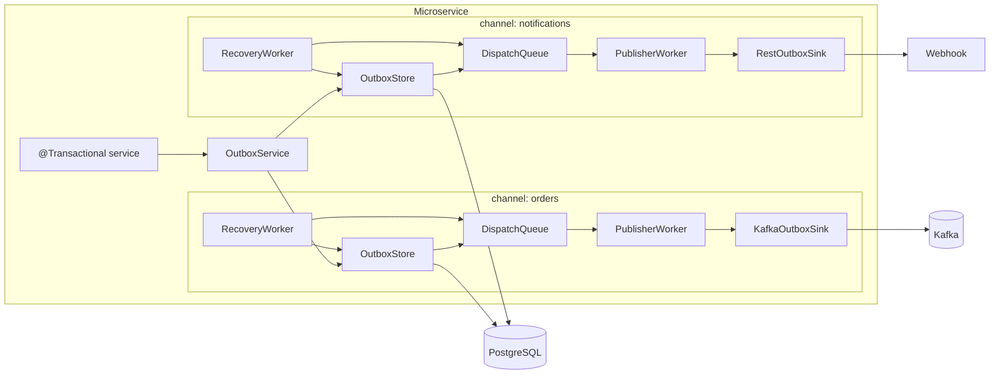
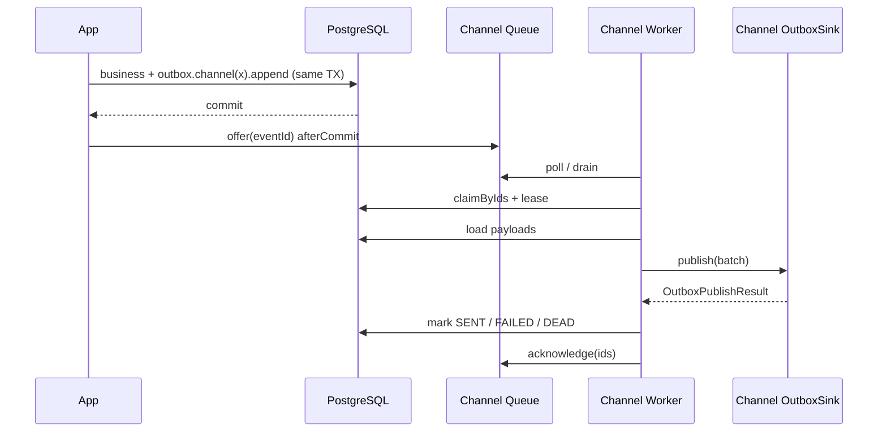
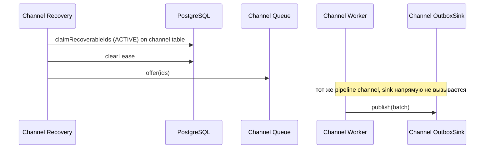

# Техническое задание: `spring-boot-outbox-starter`

**Версия документа:** 1.2  
**Статус:** Draft  
**Целевой репозиторий:** [отдельный] `https://github.com/KHolodilin/spring-boot-outbox-starter`  
**Стек:** Java 21, Spring Boot 4.1, Maven, PostgreSQL  
**Связанные проекты:**
- [`spring-boot-idempotency-starter`](https://github.com/KHolodilin/spring-boot-idempotency-starter) — отдельно; не входит в scope outbox
- [`spring-transactional-outbox-kafka`](https://github.com/KHolodilin/spring-transactional-outbox-kafka) — reference / будущий consumer стартера

**Changelog:**
- **1.1** — multi-channel first-class, table-per-channel, `@OutboxChannelSink`
- **1.2** — требования к Javadoc (public API) и подробным DEBUG-логам pipeline

---

## 1. Цель

Выпустить переиспользуемый Spring Boot starter для **Transactional Outbox** с поддержкой **нескольких каналов (channels)** в одном микросервисе:

1. Запись outbox-события в **той же DB-транзакции**, что и бизнес-изменения (в store выбранного channel).
2. После commit — постановка `eventId` в **dispatch queue этого channel** (memory / Redis).
3. Фоновый worker **на каждый channel**: claim/lease → batch load → вызов **`OutboxSink` channel** → `SENT` / `FAILED` / `DEAD`.
4. Recovery worker **на каждый channel**: только re-enqueue unpublished ACTIVE rows в очередь того же channel (единый pipeline внутри channel).

**Channel** = именованный изолированный pipeline:

```text
channel → table → dispatch queue → publisher worker → OutboxSink
```

В одном МС можно собрать несколько outbox (например `orders` → Kafka, `notifications` → REST) с разным backpressure, retry и lease.

Если `outbox.channels` не задан — работает один implicit channel `default` (простой DX).

**Не цель стартера:** идемпотентность HTTP-запросов, доменная state machine, Modulith EPR, конкретный брокер как обязательная зависимость.

---

## 2. Нефункциональные требования

| ID | Требование |
|----|------------|
| NFR-1 | Java 21+, Spring Boot 4.1.x |
| NFR-2 | PostgreSQL как source of truth для outbox rows |
| NFR-3 | At-least-once delivery; идемпотентность на стороне consumer/sink target |
| NFR-4 | Multi-instance safe claim через `FOR UPDATE SKIP LOCKED` + lease |
| NFR-5 | Line coverage ≥ 80% (JaCoCo), как в idempotency-starter |
| NFR-6 | Spotless (Palantir), enforcer, Javadoc на public API |
| NFR-7 | Публикация: GitHub Packages + Maven Central (профиль `release`) |
| NFR-8 | README и публичные примеры — **на английском** (как idempotency-starter) |
| NFR-9 | Apache License 2.0 |
| NFR-10 | Несколько channel в одном приложении: изоляция queue/worker/sink/table |
| NFR-11 | Public API документирован Javadoc (английский); `maven-javadoc-plugin` в verify |
| NFR-12 | DEBUG-логи покрывают весь pipeline с `channel`, `eventId`, batch size, outcome |

---

## 3. Название и координаты артефактов

| | Значение |
|---|---|
| GitHub repo | `spring-boot-outbox-starter` |
| Parent GAV | `com.kholodilin:spring-boot-outbox-starter-parent` |
| Starter artifact | `com.kholodilin:spring-boot-outbox-starter` |
| First version | `0.1.0-SNAPSHOT` → `0.1.0` |

---

## 4. Модули

```
spring-boot-outbox-starter-parent
├── outbox-core
├── outbox-persistence-jdbc
├── outbox-queue-memory
├── outbox-queue-redis                 # optional
├── outbox-spring-boot-starter         # artifactId: spring-boot-outbox-starter
├── outbox-demo-kafka
└── outbox-demo-rest
```

| Module | Назначение |
|--------|------------|
| `outbox-core` | Модель, SPI, fluent API, `OutboxChannel` / registry, pipeline-логика workers |
| `outbox-persistence-jdbc` | `OutboxStore` на JDBC/PostgreSQL, DDL template per table, schema create/validate |
| `outbox-queue-memory` | Default `OutboxDispatchQueue` (per-process, per-channel instance) |
| `outbox-queue-redis` | Shared wake-up queue (fail-open), отдельный key-prefix на channel |
| `spring-boot-outbox-starter` | Auto-configuration, channels properties, Micrometer, health |
| `outbox-demo-kafka` | Demo: 1 channel `default` + Kafka `OutboxSink` |
| `outbox-demo-rest` | Demo: **2 channels** (`payments` + `webhooks`) — Kafka/stub + REST |

**Явно отсутствует в v1:** `outbox-sink-kafka` как обязательный модуль стартера.  
Kafka/REST sink живут в **демо / приложении**.

---

## 5. Архитектура

### 5.1. Multi-channel схема



### 5.2. Normal flow (внутри одного channel)



Батчинг publisher (per channel): `poll` → `drain(batchSize)` → claim/load → `sink.publish(List)` → mark/ack.

### 5.3. Recovery flow (внутри одного channel)



### 5.4. Границы ответственности

| Компонент | Владелец | Ответственность |
|-----------|----------|-----------------|
| `OutboxService` | starter | fluent API; резолв channel; append + afterCommit |
| `OutboxChannel` / `OutboxChannelRegistry` | starter | именованные pipeline |
| `OutboxStore` | starter (jdbc) | CRUD/claim/status/lease **на table channel** |
| `OutboxDispatchQueue` | starter (queue modules) | wake-up coalesce + backpressure **на channel** |
| `OutboxSink` | **приложение / demo** | доставка batch; binding на channel |
| Idempotency | **отдельный стартер** | не часть outbox |
| Domain payload mapping | приложение | opaque JSON в `payload` |

### 5.5. Инварианты

1. PostgreSQL — единственный source of truth для outbox rows.
2. Dispatch queue — best-effort; `offer=false` допустим; recovery обязателен.
3. Recovery **никогда** не вызывает `OutboxSink` напрямую.
4. Статусы ACTIVE (`< 100`) / ARCHIVE (`≥ 100`) с partition pruning для recovery.
5. `OutboxSink` не меняет статусы в БД — только starter после `publish`.
6. At-least-once: sink/target идемпотентен по `eventId` (или эквиваленту).
7. Channels изолированы: очередь/worker/recovery/sink одного channel не обслуживают другой.
8. v1 persistence: **table-per-channel** (не shared table + колонка `channel`).
9. Неизвестный channel в `.channel("...")` → fail-fast при `append()` (или earlier).
10. Несколько `eventType` в одном channel — норма; очередь хранит только `eventId`, тип читается из БД.

---

## 6. Channels (first-class)

### 6.1. Модель

```java
/**
 * Named, isolated outbox pipeline: store + dispatch queue + sink + tuning.
 * <p>
 * Each channel owns its PostgreSQL table, wake-up queue, publisher thread,
 * and recovery loop so a slow sink on one channel cannot block another.
 */
public interface OutboxChannel {
    /** Logical channel name (e.g. {@code orders}, {@code default}). */
    String name();

    /** Durable store bound to this channel's table. */
    OutboxStore store();

    /** Best-effort wake-up queue for event ids after commit. */
    OutboxDispatchQueue queue();

    /**
     * Application-provided delivery adapter for this channel.
     *
     * @throws IllegalStateException if publisher is enabled but no sink is bound
     */
    OutboxSink sink();

    /** Effective properties after merging {@code outbox.defaults} and channel overrides. */
    OutboxChannelProperties properties();
}

/**
 * Resolves configured {@link OutboxChannel} instances for the application.
 */
public interface OutboxChannelRegistry {
    /**
     * Returns the channel or fails fast.
     *
     * @param name channel name
     * @return channel
     * @throws UnknownOutboxChannelException if {@code name} is not configured
     */
    OutboxChannel getRequired(String name);

    /** Optional lookup without throwing. */
    Optional<OutboxChannel> find(String name);

    /** All channels known at startup (at least {@code default}). */
    Collection<OutboxChannel> all();
}
```

На каждый сконфигурированный channel starter создаёт:

- 1 × `OutboxStore` (свой `table-name`);
- 1 × `OutboxDispatchQueue`;
- 1 × `PublisherWorker` (свой поток), если publisher enabled и sink найден;
- 1 × `RecoveryWorker` (свой interval / общий scheduler с per-channel tick).

### 6.2. Default channel

- Если `outbox.channels` **пуст / не задан** → registry содержит один channel `default`.
- `outboxService.eventType(...)` эквивалентен `outboxService.channel("default").eventType(...)`.
- Table по умолчанию: `outbox_events`.

### 6.3. Когда заводить второй channel

| Ситуация | Решение |
|----------|---------|
| Много `eventType`, один транспорт | один channel |
| Разные sink (Kafka + REST) / разный backpressure | **отдельные channels** |
| Нужна изоляция потоков (медленный HTTP не тормозит Kafka) | **отдельные channels** |

---

## 7. Публичный API

### 7.1. Fluent API (обязательный стиль)

Стиль — как у `IdempotencyService`:

```java
idempotencyService
    .operation("CREATE_PAYMENT")
    .key(key)
    .request(request)
    .ttl(Duration.ofDays(30)) // optional
    .execute(PaymentResult.class, () -> { ... });
```

Outbox (single channel / default):

```java
outboxService
    .eventType("ORDER_CREATED")
    .aggregateId(String.valueOf(orderId))
    .partitionKey(String.valueOf(customerId))
    .payload(payloadJson)
    .header("correlationId", corrId)      // optional
    .traceParent(traceParent)             // optional
    .append();                            // returns eventId (long)
```

Outbox (explicit channel):

```java
outboxService
    .channel("orders")
    .eventType("ORDER_CREATED")
    .aggregateId(String.valueOf(orderId))
    .partitionKey(String.valueOf(customerId))
    .payload(orderPayload)
    .append();

outboxService
    .channel("notifications")
    .eventType("ORDER_EMAIL_REQUESTED")
    .aggregateId(String.valueOf(orderId))
    .partitionKey(String.valueOf(customerId))
    .payload(emailPayload)
    .append();
```

Оба `append()` могут быть в **одной** бизнес-транзакции; после commit — `offer` в **две разные** очереди.

#### Контракт + Javadoc (норматив для реализации)

```java
/**
 * Entry point for appending outbox events inside an active database transaction.
 * <p>
 * Usage mirrors {@code IdempotencyService}: build a fluent call, then {@link OutboxAppend#append()}.
 * After the surrounding transaction commits, the starter enqueues the generated event id
 * on the channel's {@link OutboxDispatchQueue} for asynchronous delivery via {@link OutboxSink}.
 *
 * <pre>{@code
 * outboxService
 *     .channel("orders")
 *     .eventType("ORDER_CREATED")
 *     .aggregateId(String.valueOf(orderId))
 *     .partitionKey(customerId)
 *     .payload(payload)
 *     .append();
 * }</pre>
 *
 * <p>Must be called inside an active transaction: the outbox row is committed atomically
 * with business changes. A rollback also rolls back the outbox row — half-published states
 * from this path are impossible.
 */
public interface OutboxService {

    /**
     * Selects the target channel for the following append.
     *
     * @param channel configured channel name (e.g. {@code orders})
     * @return fluent builder bound to that channel
     * @throws UnknownOutboxChannelException if the channel is not registered
     */
    OutboxAppend channel(String channel);

    /**
     * Shorthand for {@code channel("default").eventType(eventType)}.
     *
     * @param eventType business event type stored in the outbox row
     * @return fluent builder on the {@code default} channel
     */
    OutboxAppend eventType(String eventType);
}

/**
 * Fluent builder for a single outbox append.
 * <p>
 * Required before {@link #append()}: {@code eventType}, {@code aggregateId},
 * {@code partitionKey}, and {@code payload}. Optional: headers and {@code traceParent}.
 */
public interface OutboxAppend {

    /**
     * Sets the business event type (e.g. {@code ORDER_CREATED}).
     *
     * @param eventType non-blank event type
     * @return this builder
     */
    OutboxAppend eventType(String eventType);

    /**
     * Sets the aggregate identifier used for correlation (opaque to the starter).
     *
     * @param aggregateId non-blank aggregate id
     * @return this builder
     */
    OutboxAppend aggregateId(String aggregateId);

    /**
     * Sets the partitioning / ordering key passed to {@link OutboxSink}
     * (for example a Kafka message key).
     *
     * @param partitionKey non-blank partition key
     * @return this builder
     */
    OutboxAppend partitionKey(String partitionKey);

    /**
     * Sets the payload as a JSON string stored in {@code payload} jsonb.
     *
     * @param json non-blank JSON document
     * @return this builder
     */
    OutboxAppend payload(String json);

    /**
     * Serializes {@code value} with the configured ObjectMapper and stores it as jsonb.
     *
     * @param value object to serialize; must not be {@code null}
     * @return this builder
     * @throws OutboxSerializationException if serialization fails
     */
    OutboxAppend payload(Object value);

    /**
     * Adds a single delivery header (stored with the row and exposed on {@link OutboxRecord}).
     *
     * @param name  header name
     * @param value header value
     * @return this builder
     */
    OutboxAppend header(String name, String value);

    /**
     * Replaces or merges delivery headers (implementation documents merge vs replace).
     *
     * @param headers header map; {@code null} values are rejected
     * @return this builder
     */
    OutboxAppend headers(Map<String, String> headers);

    /**
     * Optional W3C {@code traceparent} captured at append time for sink propagation.
     *
     * @param traceParent W3C traceparent, or {@code null} to clear
     * @return this builder
     */
    OutboxAppend traceParent(String traceParent);

    /**
     * Inserts a {@code NEW} outbox row in the current transaction and registers
     * an after-commit enqueue of the generated id on the channel queue.
     *
     * @return generated event id
     * @throws MissingTransactionException if no transaction synchronization is active
     * @throws IllegalStateException if required fields are missing
     */
    long append();
}
```

#### Правила

- `append()` только внутри активной DB-транзакции.
- До `append()` обязательны: `eventType`, `aggregateId`, `partitionKey`, `payload`.
- `partitionKey` для sink; starter домен не интерпретирует.
- После commit: `channel.queue().offer(eventId)`.

#### Композиция с idempotency-starter

```java
@Transactional
public ExecutionResult<PaymentResult> createPayment(String key, CreatePaymentRequest request) {
    return idempotencyService
            .operation("CREATE_PAYMENT")
            .key(key)
            .request(request)
            .ttl(Duration.ofDays(30))
            .execute(PaymentResult.class, () -> {
                long paymentId = paymentRepository.insert(...);

                outboxService
                        .channel("payments")
                        .eventType("PAYMENT_CREATED")
                        .aggregateId(String.valueOf(paymentId))
                        .partitionKey(request.customerId())
                        .payload(Map.of("paymentId", paymentId, "amount", request.amount()))
                        .append();

                outboxService
                        .channel("webhooks")
                        .eventType("PAYMENT_WEBHOOK")
                        .aggregateId(String.valueOf(paymentId))
                        .partitionKey(request.customerId())
                        .payload(Map.of("paymentId", paymentId))
                        .append();

                return ExecutionResult.success(new PaymentResult(paymentId));
            });
}
```

### 7.2. `OutboxSink` (вне стартера, per channel)

```java
/**
 * Application-owned delivery adapter invoked by the channel publisher worker.
 * <p>
 * Implementations must be idempotent with respect to {@link OutboxRecord#eventId()}:
 * the starter provides at-least-once delivery. The sink must not mutate outbox tables;
 * the starter updates status from {@link OutboxPublishResult}.
 */
public interface OutboxSink {

    /**
     * Delivers a claimed batch to the external system (Kafka, HTTP, …).
     *
     * @param batch non-empty list of records already claimed under a lease
     * @return outcome for the whole batch (v1: all-or-nothing)
     */
    OutboxPublishResult publish(List<OutboxRecord> batch);
}

/**
 * Result of {@link OutboxSink#publish(List)}.
 * <p>
 * v1 supports all-succeeded / all-failed only. Partial per-id outcomes are reserved for a later version.
 */
public sealed interface OutboxPublishResult {
    /** All records in the batch were delivered successfully. */
    record AllSucceeded() implements OutboxPublishResult {}

    /**
     * Delivery failed for the batch; starter marks rows {@code FAILED} (or {@code DEAD} after max retries).
     *
     * @param cause optional cause for logging; may be {@code null}
     */
    record AllFailed(Throwable cause) implements OutboxPublishResult {}
}

/**
 * Immutable view of an outbox row loaded for publishing.
 *
 * @param channel       channel name that owns the row
 * @param eventId       primary key
 * @param eventType     business type
 * @param aggregateId   opaque aggregate id
 * @param partitionKey  sink partitioning key
 * @param payloadJson   JSON payload as stored
 * @param headers       delivery headers (never {@code null}; may be empty)
 * @param traceParent   optional W3C traceparent
 * @param retryCount    current retry counter before this attempt
 * @param createdAt     row creation time
 */
public record OutboxRecord(
        String channel,
        long eventId,
        String eventType,
        String aggregateId,
        String partitionKey,
        String payloadJson,
        Map<String, String> headers,
        String traceParent,
        int retryCount,
        Instant createdAt
) {}
```

#### Binding sink → channel

```java
/**
 * Binds an {@link OutboxSink} bean to a named outbox channel.
 * <p>
 * Exactly one sink must be registered for each channel with {@code publisher.enabled=true}.
 */
@Target(ElementType.TYPE)
@Retention(RetentionPolicy.RUNTIME)
@Documented
public @interface OutboxChannelSink {
    /** Channel name, matching {@code outbox.channels.<name>}. */
    String value();
}
```

```java
@Component
@OutboxChannelSink("orders")
public class KafkaOrdersSink implements OutboxSink { ... }

@Component
@OutboxChannelSink("notifications")
public class RestNotificationsSink implements OutboxSink { ... }
```

Правила auto-config:

1. Для каждого channel с `publisher.enabled=true` обязателен ровно один sink.
2. Нет sink → **fail-fast** при старте с именем channel.
3. Единственный `OutboxSink` без аннотации → только для channel `default`.
4. `publisher.enabled=false` — write-only; worker не стартует.

#### Требования к sink

1. Не обновлять таблицы outbox самостоятельно.
2. Допускать повтор для того же `eventId`.
3. Ошибка → throw или `AllFailed`.
4. Уважать таймауты относительно `lease-duration` channel.

### 7.3. SPI store / queue (Javadoc-норматив)

```java
/**
 * Durable persistence for one outbox channel table.
 * <p>
 * All claim operations must be multi-instance safe ({@code FOR UPDATE SKIP LOCKED} + lease).
 */
public interface OutboxStore {
    /** Inserts a {@code NEW} row and returns the generated id. */
    long insert(NewOutboxEvent event);

    /** Claims rows by ids under {@code lockedBy}/{@code lockedUntil}; returns claimed rows. */
    List<OutboxRecord> claimByIds(Collection<Long> ids, String lockedBy, Instant lockedUntil);

    /** Finds recoverable ACTIVE ids and optionally claims them for recovery hand-off. */
    List<Long> claimRecoverableIds(int limit, String lockedBy, Instant lockedUntil);

    /** Clears lease so the publisher can claim after recovery re-enqueue. */
    void clearLease(Collection<Long> ids);

    /** Marks successfully published rows as {@code SENT} (archive partition). */
    void markSent(Collection<Long> ids, Instant sentAt);

    /** Increments retry and sets {@code FAILED}, or {@code DEAD} when max retries exceeded. */
    void markFailed(Collection<Long> ids, int maxRetries);
}

/**
 * Best-effort wake-up queue of outbox event ids for one channel.
 * <p>
 * Not a source of truth: rejected or lost ids remain recoverable from PostgreSQL.
 * Implementations must coalesce duplicates and track in-flight ids until {@link #acknowledge}.
 */
public interface OutboxDispatchQueue {
    /**
     * Offers an event id after commit (or from recovery).
     *
     * @return {@code false} if duplicate, in-flight, or backpressure (queue full)
     */
    boolean offer(long eventId);

    /** Blocks up to {@code timeout} for the next id; moves it to in-flight. */
    Long poll(Duration timeout) throws InterruptedException;

    /** Non-blocking drain of up to {@code max} additional ids (all become in-flight). */
    List<Long> drain(int max);

    /** Releases in-flight ids after publish attempt (success or failure). */
    void acknowledge(Collection<Long> eventIds);

    int size();
    int capacity();

    /** Fill ratio in {@code [0..1]} for health and adaptive throttling. */
    double pressure();
}
```

---

## 8. Javadoc requirements (норматив)

Javadoc — **английский**, стиль как в `spring-boot-idempotency-starter` / текущем order-service.

### 8.1. Что документировать

| Элемент | Требование |
|---------|------------|
| Public types в `outbox-core` / starter API | class/interface/record/enum level summary + `<p>` для инвариантов |
| Public methods / constructors | one-line summary; `@param` / `@return` / `@throws` где применимо |
| SPI (`OutboxStore`, `OutboxDispatchQueue`, `OutboxSink`) | контракт, thread-safety / at-least-once notes |
| Auto-config classes | краткий class Javadoc: что поднимает и при каких conditions |
| Package-private workers | class + ключевые methods (start/stop/loop/recover) — желательно |
| Demo apps | class Javadoc на sink/controller достаточно |

### 8.2. Правила оформления

1. Первое предложение — summary без «This class…».
2. Инварианты и side effects — в `<p>` / `<ul>`.
3. Примеры использования — `{@code ...}` / `<pre>{@code ...}</pre>` на entry points (`OutboxService`, `OutboxSink`).
4. `{@link}` на связанные типы.
5. `maven-javadoc-plugin`: `doclint=all,-missing` **не** использовать ослабление для public API library modules — **полный** `@param`/`@return` на public methods; для package-private допускается `-missing` как в sibling, **предпочтительно полный Javadoc на всём public API**.
6. CI: `javadoc` jar на verify для library modules.

### 8.3. Пример уровня класса (эталон)

```java
/**
 * Background worker that drains one channel's dispatch queue and publishes via {@link OutboxSink}.
 * <p>
 * Pipeline per iteration: poll → drain batch → claim rows → {@code sink.publish} → mark status → ack.
 * One worker thread is dedicated per channel so channels do not share a publishing loop.
 */
public final class OutboxPublisherWorker { ... }
```

---

## 9. Logging requirements

Logger names: классы pipeline (`OutboxService` impl, queue, publisher worker, recovery worker, jdbc store).  
Рекомендуемый app-level override: `logging.level.com.kholodilin.outbox=DEBUG`.

### 9.1. Уровни

| Level | Когда |
|-------|--------|
| **INFO** | редкие бизнес-значимые факты: channel started/stopped; recovery enqueued count &gt; 0; publish batch succeeded (можно агрегировано); FATAL path summary |
| **WARN** | queue full / offer rejected; sink failure; lease/claim miss; approaching DEAD |
| **ERROR** | unexpected exceptions in worker loop; startup binding failures |
| **DEBUG** | подробный шаг за шагом по pipeline (обязательно, см. ниже) |
| **TRACE** | опционально: полный список ids в batch, payload size — не логировать полный payload по умолчанию |

### 9.2. Обязательные DEBUG-сообщения

Каждое сообщение должно включать **`channel`** и релевантные ids. Формат полей — structured-friendly (key=value в тексте достаточно для v1).

| Этап | DEBUG (минимум) |
|------|-----------------|
| Fluent append | `channel`, `eventType`, `aggregateId`, `partitionKey`, headers keys (не values secrets), `payloadBytes` / length |
| Append DB insert | `channel`, `eventId`, `table` |
| afterCommit register | `channel`, `eventId` |
| offer result | `channel`, `eventId`, `offered=true\|false`, `reason=duplicate\|in_flight\|full` при false, `queueSize`, `pressure` |
| poll | `channel`, `eventId` или `timeout`, `batchWait` |
| drain | `channel`, `drained`, `batchIds` (до N ids; если больше — `drained` + first/last), `queueSize` |
| claim | `channel`, `requested`, `claimed`, `lockedBy`, `lockedUntil`, unclaimed ids if any |
| load | `channel`, `loaded`, per-row optional TRACE |
| sink publish start | `channel`, `batchSize`, `eventTypes` histogram / distinct types |
| sink publish end | `channel`, `batchSize`, `result=AllSucceeded\|AllFailed`, duration ms; cause message on fail |
| mark sent/failed/dead | `channel`, `ids`, `status`, `retryCount` where relevant |
| acknowledge | `channel`, `acked` |
| recovery tick | `channel`, `enabled`, when empty: `claimed=0` (DEBUG only; не INFO spam) |
| recovery enqueue | `channel`, `claimed`, `enqueued`, `skipped`, id list at DEBUG |
| worker start/stop | `channel`, thread name |
| redis fail-open | `channel`, operation, exception class/message |

### 9.3. INFO (не спамить)

- Старт channel publisher/recovery один раз.
- Recovery: **INFO только если** `enqueued > 0`.
- Publish success: либо DEBUG, либо INFO раз на batch с `batchSize` (выбрать одно в реализации; рекомендация — **DEBUG** для success, **WARN/ERROR** для fail).

### 9.4. Чего не логировать

- Полный payload / PII на INFO/WARN (на DEBUG — только length / hash опционально).
- Секреты из headers.
- Каждые пустые recovery ticks на INFO.

### 9.5. Примеры DEBUG

```text
DEBUG c.k.o.DefaultOutboxService - outbox append channel=orders eventType=ORDER_CREATED aggregateId=42 partitionKey=7 payloadBytes=128
DEBUG c.k.o.jdbc.JdbcOutboxStore - outbox inserted channel=orders eventId=1001 table=outbox_events_orders
DEBUG c.k.o.AfterCommitEnqueue - outbox afterCommit offer channel=orders eventId=1001 offered=true queueSize=3 pressure=0.00
DEBUG c.k.o.PublisherWorker - outbox poll channel=orders eventId=1001
DEBUG c.k.o.PublisherWorker - outbox drain channel=orders drained=2 batchIds=[1001,1002] queueSize=0
DEBUG c.k.o.jdbc.JdbcOutboxStore - outbox claim channel=orders requested=2 claimed=2 lockedBy=pod-a lockedUntil=2026-08-12T09:00:30Z
DEBUG c.k.o.PublisherWorker - outbox sink publish start channel=orders batchSize=2 eventTypes=[ORDER_CREATED]
DEBUG c.k.o.PublisherWorker - outbox sink publish end channel=orders batchSize=2 result=AllSucceeded durationMs=14
DEBUG c.k.o.jdbc.JdbcOutboxStore - outbox markSent channel=orders ids=[1001,1002]
DEBUG c.k.o.PublisherWorker - outbox ack channel=orders acked=2
DEBUG c.k.o.RecoveryWorker - outbox recovery tick channel=orders claimed=0
DEBUG c.k.o.RecoveryWorker - outbox recovery enqueue channel=orders claimed=5 enqueued=4 skipped=1 ids=[1003,1004,1005,1006,1007]
```

---

## 10. SPI очереди (сводка)

| Реализация | Module | Семантика |
|------------|--------|-----------|
| Memory | `outbox-queue-memory` | per-process, **отдельный instance на channel** |
| Redis | `outbox-queue-redis` | shared wake-up, fail-open, **отдельный key-prefix на channel** |

Очередь **не** несёт `eventType` — только `eventId`.

---

## 11. Persistence / schema

### 11.1. Table-per-channel (v1)

```text
outbox_events                 # channel default
outbox_events_orders          # channel orders
outbox_events_notifications   # channel notifications
```

Shared table + колонка `channel` — **out of scope v1**.

### 11.2. DDL template

```sql
CREATE TABLE <table_name> (
    id              BIGINT GENERATED BY DEFAULT AS IDENTITY,
    aggregate_id    VARCHAR(128)  NOT NULL,
    partition_key   VARCHAR(128)  NOT NULL,
    event_type      VARCHAR(128)  NOT NULL,
    payload         JSONB         NOT NULL,
    headers         JSONB,
    status          INT           NOT NULL,
    retry_count     INT           NOT NULL DEFAULT 0,
    locked_by       VARCHAR(128),
    locked_until    TIMESTAMPTZ,
    trace_parent    TEXT,
    sent_at         TIMESTAMPTZ,
    created_at      TIMESTAMPTZ   NOT NULL DEFAULT NOW(),
    PRIMARY KEY (status, id)
) PARTITION BY RANGE (status);
```

Статусы: `NEW=0`, `PROCESSING=1`, `FAILED=2`, `DEAD=101`, `SENT=110`.

### 11.3. Schema mode

```yaml
outbox:
  defaults:
    persistence:
      schema:
        mode: validate    # create | validate | none
```

---

## 12. Configuration

```yaml
outbox:
  enabled: true
  instance-id: ${HOSTNAME:local}

  defaults:
    persistence:
      schema:
        mode: validate
    queue:
      type: memory              # memory | redis | auto
      capacity: 10000
      batch-size: 250
      batch-wait: 50ms
      usage-threshold: 0.8
      redis:
        key-prefix: "outbox:"
    publisher:
      enabled: true
      lease-duration: 30s
      max-retries: 5
    recovery:
      enabled: true
      interval: 10s
      batch-size: 500

  channels:
    orders:
      persistence:
        table-name: outbox_events_orders
      queue:
        type: memory
        capacity: 20000

    notifications:
      persistence:
        table-name: outbox_events_notifications
      queue:
        type: redis
        redis:
          key-prefix: "outbox:notifications:"
      publisher:
        max-retries: 10
        lease-duration: 60s
      recovery:
        interval: 15s
```

Пустой `channels` → implicit `default` + table `outbox_events`.

---

## 13. Auto-configuration

При наличии `DataSource`:

1. Собрать `OutboxChannelRegistry` из `outbox.channels` (или implicit `default`).
2. Для каждого channel: store + queue + schema validate/create.
3. Забиндить `OutboxSink` по `@OutboxChannelSink` / fallback для `default`.
4. Поднять per-channel `PublisherWorker` / `RecoveryWorker`.
5. Зарегистрировать `OutboxService`.
6. Micrometer + health с tag/detail `channel`.
7. Логгеры pipeline используют стандартный SLF4J (см. §9).

Kafka / WebClient **не** зависимости starter.

---

## 14. Демо-приложения

### 14.1. `outbox-demo-kafka`

Один channel `default` → `KafkaOutboxSink` → topic `payments.events`.

### 14.2. `outbox-demo-rest` (multi-channel)

| Channel | Table | Sink |
|---------|-------|------|
| `payments` | `outbox_events_payments` | Kafka или stub |
| `webhooks` | `outbox_events_webhooks` | REST → WireMock |

Один POST → два `append()` в одной TX. Проверяет изоляцию pipeline и `@OutboxChannelSink`.

В demo `application-dev.yml`: `logging.level.com.kholodilin.outbox=DEBUG` для демонстрации §9.

---

## 15. Тестирование

### 15.1. Уровни

| Уровень | Где | Что |
|---------|-----|-----|
| Unit | `outbox-core` | fluent API, channel resolve, workers helpers |
| Unit | queue modules | offer/dedup/in-flight/pressure/ack |
| Integration JDBC | persistence | table-per-channel, claim, SKIP LOCKED |
| Integration starter | starter | multi-channel auto-config, missing sink |
| IT demos | demo modules | Kafka / dual-channel REST |

### 15.2. Обязательные сценарии

1. Append без транзакции → ошибка.  
2. Rollback → нет publish.  
3. Commit → batch publish → `SENT`.  
4. Sink fail → `FAILED` → recovery → retry.  
5. Max retries → `DEAD`.  
6. Queue full → recovery.  
7. Duplicate offer → false.  
8. Multi-instance `SKIP LOCKED`.  
9. Missing sink → startup fail с именем channel.  
10. Redis fail-open.  
11. Unknown channel → ошибка.  
12. Two channels isolation IT.  
13. Multiple `eventType` в одном channel → один batch/worker.  
14. **Javadoc:** `mvn javadoc:jar` успешен на library modules.  
15. **Logging (optional assert):** при DEBUG unit/IT с ListAppender — offer/claim/publish markers присутствуют (хотя бы smoke на одном тесте).

### 15.3. Coverage

JaCoCo line ≥ **0.80** на library modules.

---

## 16. README

Английский, структура как у idempotency-starter, плюс секции:

- Multi-channel + fluent `.channel(...)`
- `@OutboxChannelSink`
- Logging (`DEBUG` examples, recommended logger levels)
- Link to Javadoc / API notes

---

## 17. Observability

Метрики с tag `channel`:

- `outbox_enqueue_total{channel}`
- `outbox_dequeue_total{channel}`
- `outbox_publish_total{channel,result}`
- `outbox_publish_seconds{channel}`
- `outbox_recovery_total{channel}`
- `outbox_queue_size{channel}`, `outbox_queue_pressure{channel}`

Health: aggregate `outbox` с details per channel.

---

## 18. Out of scope (v1)

- Shared single table + колонка `channel`
- R2DBC / WebFlux worker
- Partial batch success API
- Debezium / CDC / Modulith EPR
- Built-in sagas / idempotency inside outbox
- Обязательный Kafka module
- Dynamic channel registration at runtime
- Logging полного payload на DEBUG по умолчанию

---

## 19. План поставки

| Phase | Deliverable |
|-------|-------------|
| P0 | Repo skeleton, CI, Spotless |
| P1 | `outbox-core`: API + Javadoc + channel registry |
| P2 | `outbox-persistence-jdbc` + IT + DEBUG logs в store |
| P3 | queue-memory + workers/recovery + DEBUG pipeline logs |
| P4 | Starter auto-config + `@OutboxChannelSink` |
| P5 | `outbox-demo-kafka` + DEBUG profile |
| P6 | `outbox-demo-rest` multi-channel + IT |
| P7 | `outbox-queue-redis` |
| P8 | README, javadoc jars, coverage, `0.1.0` |
| P9 | Integrate into reference outbox project |

---

## 20. Критерии приёмки

1. CI green; JaCoCo ≥ 80% на library modules.  
2. Single-channel + multi-channel E2E.  
3. Fluent API + `.channel(...)` как в §7.  
4. Public API с Javadoc (§8); `javadoc:jar` OK.  
5. DEBUG-логи покрывают append → offer → poll/drain → claim → sink → mark → ack → recovery (§9).  
6. Демо Kafka и REST; в dev включён DEBUG для `com.kholodilin.outbox`.  
7. Нет hard-dependency на Kafka/WebClient в starter.  
8. Idempotency не встроен; есть пример композиции.  
9. Unknown channel / missing sink → понятный fail-fast.

---

## 21. Риски и решения

| Риск | Митигация |
|------|-----------|
| Путаница outbox vs job queue | README + Javadoc границы |
| Redis как SoT | Инвариант; fail-open |
| DEBUG spam / PII | только ids/lengths; пустой recovery на DEBUG |
| Смешение sink | multi-channel |
| Сложный DX | implicit `default` |

---

## 22. Глоссарий

| Термин | Значение |
|--------|----------|
| Channel | Именованный изолированный outbox pipeline |
| Outbox row | Durable запись намерения доставить событие |
| Dispatch queue | Wake-up канал `eventId` внутри channel (не SoT) |
| Sink | Пользовательская доставка batch, bound к channel |
| Claim / lease | Захват ACTIVE row под publisher instance |
| Recovery | Re-enqueue unpublished ids в queue того же channel |
| Table-per-channel | Отдельная Postgres-таблица на каждый channel (v1) |
| Batch publish | poll + drain → один `OutboxSink.publish(List)` |
