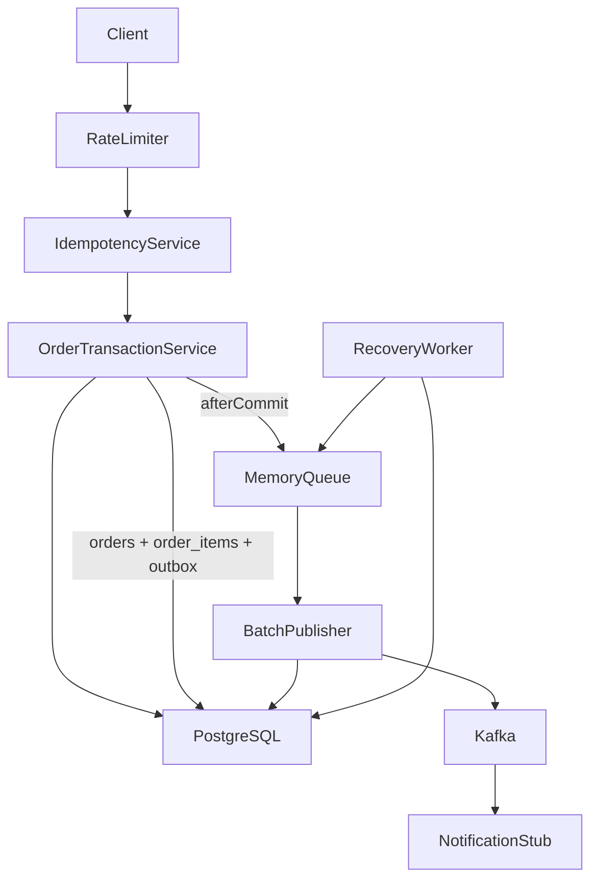
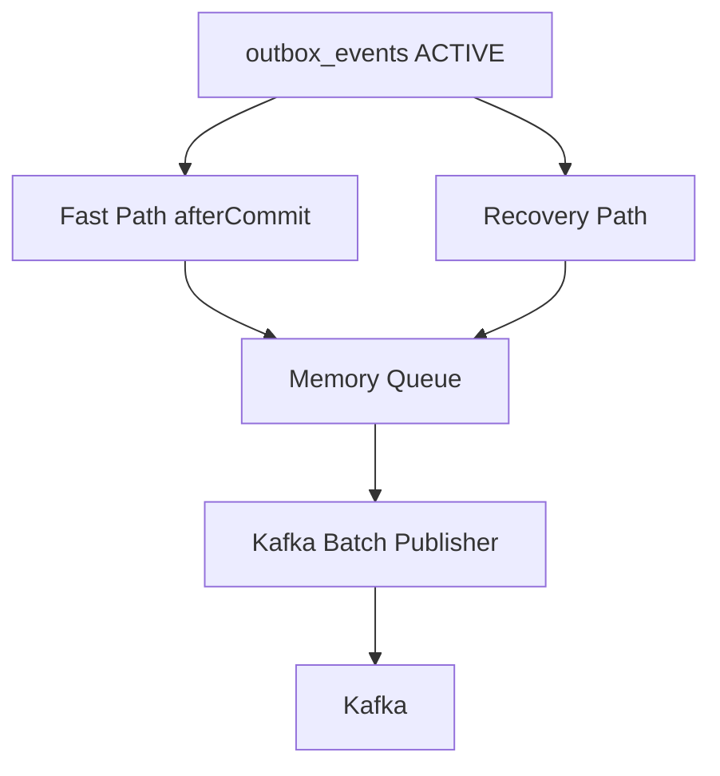
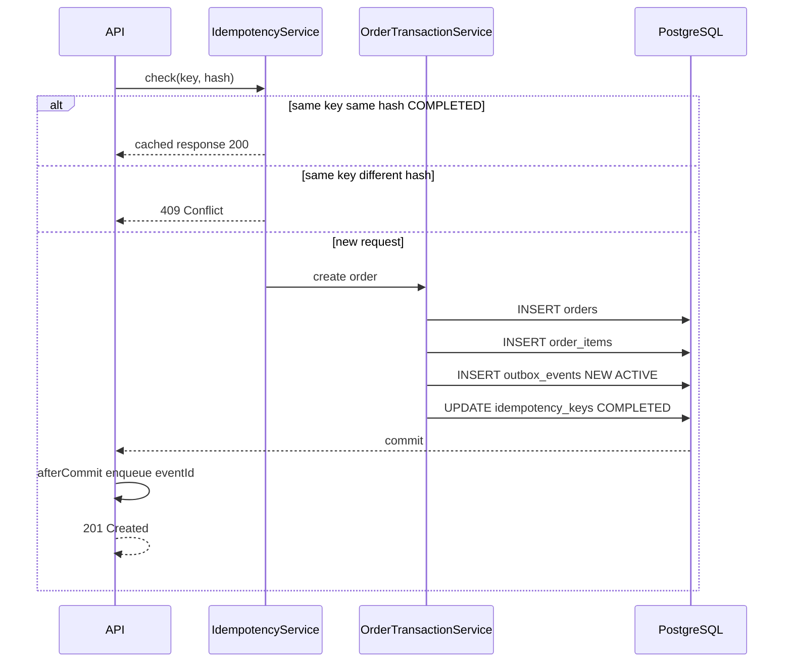
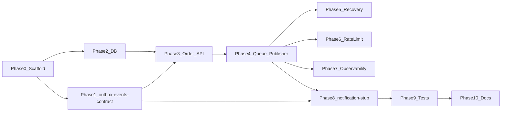

# План реализации spring-transactional-outbox-kafka

> См. также: [Техническое задание v2](spring-transactional-outbox-kafka-Technical-Specification-v2.md)

## Исходное состояние

Репозиторий greenfield: [ТЗ v2](spring-transactional-outbox-kafka-Technical-Specification-v2.md), [план работ](spring-transactional-outbox-kafka-Implementation-Plan.md) и пустой [README.md](../README.md). Код отсутствует.

## Принятые решения

- **Build tool:** Maven (parent POM + 3 модуля)
- **Shared contract:** `outbox-events-contract` — общие DTO/enums между `order-service` и `notification-stub` (не runtime-сервис)
- **Downstream stub:** `notification-stub` — заглушка нотификации (mock), без реальной отправки и без БД
- **Домен:** классический flow `Order -> Outbox` в одной транзакции
- **API:** `POST /api/v1/orders` + заголовок `Idempotency-Key`
- **Package base:** `com.kholodilin.outbox`
- **DB:** таблицы `orders`, `order_items`, `idempotency_keys`, `outbox_events`; view `outbox_events_active` для hot-path
- **Партиционирование PostgreSQL:** HASH (10 partitions) для `orders` и `idempotency_keys` по `customer_id`
- **Kafka partition key:** `customer_id` — все события одного заказчика в одну партицию topic (ordering per customer)
- **Целостность:** без FK на hot-path; связь `order_items.order_id` — на уровне приложения
- **Публикация:** единый pipeline — Fast Path (afterCommit) и Recovery Path сходятся в Memory Queue → Kafka Batch Publisher

## Целевая структура репозитория

```text
spring-transactional-outbox-kafka/
├── pom.xml
├── docker-compose.yml
├── outbox-events-contract/
│   └── pom.xml
├── order-service/
│   └── pom.xml
└── notification-stub/
    └── pom.xml
```

## Архитектура runtime



## Единый publishing pipeline



## Чеклист фаз

| # | Фаза | Статус |
|---|------|--------|
| 0 | Scaffolding и инфраструктура | done |
| 1 | outbox-events-contract | done |
| 2 | Database (Liquibase) | done |
| 3 | REST API + Order + Idempotency + Outbox write | done |
| 4 | Memory Queue + Batch Publisher | done |
| 5 | Recovery Worker | done |
| 6 | Rate Limiting + Adaptive Backpressure | done |
| 7 | Observability | done |
| 8 | notification-stub | done |
| 9 | Тесты | done |
| 10 | Документация и polish | done |

---

## Фаза 0 — Scaffolding и инфраструктура

**Цель:** собираемый multi-module проект + локальный стенд.

- Parent `pom.xml`: Java 21, Spring Boot 4 BOM, dependencyManagement для Kafka, Liquibase, Bucket4j, Micrometer, Testcontainers, Lombok
- Модули: `outbox-events-contract`, `order-service`, `notification-stub`
- `docker-compose.yml`: PostgreSQL 16, Kafka (KRaft), опционально Kafka UI
- `application.yml` / `application-dev.yml` / `application-prod.yml` в каждом сервисе по [ТЗ Configuration](spring-transactional-outbox-kafka-Technical-Specification-v2.md)
- `@ConfigurationProperties` с prefix `app.*` (outbox, rate-limit, kafka)

**Критерий готовности:** `mvn clean verify` проходит, сервисы стартуют против Docker Compose.

---

## Фаза 1 — outbox-events-contract

**Цель:** shared contract module — общие типы между producer (`order-service`) и `notification-stub`.

Файлы в `outbox-events-contract/src/main/java/com/kholodilin/outbox/events/`:

| Класс | Назначение |
|-------|------------|
| `EventEnvelope` | Kafka message: eventId, orderId, customerId, eventType, payload, correlationId, occurredAt |
| `CreateOrderRequest` | REST request: customerId, items[], correlationId? |
| `OrderItemRequest` | line item: productId, quantity, price |
| `CreateOrderResponse` | REST response: orderId, eventId, status, createdAt |
| `EventConstants` | topic name, header names, partition key field (`customerId`) |
| `OutboxStatus`, `PartitionState`, `IdempotencyStatus` | enums |

Jackson + validation annotations (`@NotNull`, `@NotBlank`, `@Positive`).

---

## Фаза 2 — Database (Liquibase)

**Цель:** схема БД по ТЗ v2, только Liquibase.

Changelog в `order-service/src/main/resources/db/changelog/`:

### `orders` (HASH partitioned, 10 partitions)

```sql
-- parent + PARTITION BY HASH (customer_id)
-- columns: id, customer_id, status, total_amount, created_at, updated_at
-- BIGINT identity primary key
-- no FK on hot path
```

### `order_items`

```sql
-- columns: id, order_id, product_id, quantity, price, created_at
-- BIGINT identity primary key
-- order_id without FK (application-level integrity)
```

### `idempotency_keys` (HASH partitioned, 10 partitions)

```sql
-- UNIQUE(customer_id, idempotency_key) B-tree
-- columns: id, customer_id, idempotency_key, request_hash,
--          status, response_body (jsonb), created_at, updated_at
-- statuses: PROCESSING, COMPLETED, FAILED
```

### `outbox_events`

```sql
-- ready-to-publish Kafka payload
-- columns: id, order_id, customer_id, event_type, payload (jsonb),
--          status, partition_state, retry_count,
--          locked_by, locked_until, sent_at, created_at
-- statuses: NEW, PROCESSING, FAILED, DEAD, SENT
-- partition_state: ACTIVE, ARCHIVE
-- indexes: (partition_state, status, locked_until)
```

### View `outbox_events_active`

```sql
CREATE VIEW outbox_events_active AS
SELECT * FROM outbox_events WHERE partition_state = 'ACTIVE';
```

**Важно:** без FK на hot-path таблицах (по ТЗ).

JPA entities для write-path (`orders`, `order_items`, `idempotency_keys`, `outbox_events`); `JdbcTemplate` + batch updates для publisher/recovery.

---

## Фаза 3 — REST API + Order + Idempotency + Outbox write

**Цель:** `POST /api/v1/orders` с идемпотентностью и transactional outbox.

### API

```
POST /api/v1/orders
Headers: Idempotency-Key (required, uuid)
Body: { customerId, items: [{ productId, quantity, price }], correlationId? }
Response 201: { orderId, eventId, status: "ACCEPTED", createdAt }
Response 200: cached idempotent response
Response 409: same key + different request hash
Response 429: rate limit exceeded
```

### Компоненты `order-service`

| Компонент | Ответственность |
|-----------|-----------------|
| `OrderController` | REST, валидация, correlationId в MDC |
| `RequestHashCalculator` | SHA-256 canonical JSON body |
| `IdempotencyService` | lookup/insert `idempotency_keys`; PROCESSING → COMPLETED/FAILED |
| `OrderTransactionService` | `@Transactional`: orders + order_items + outbox_events(NEW, ACTIVE) + idempotency |
| `OutboxEventFactory` | формирует Kafka payload (OrderCreated) для outbox |
| `OutboxEnqueueListener` | `afterCommit()` → `MemoryQueue.enqueue(eventId)` |

### Transaction flow



**Логирование (INFO):** запрос принят/отклонён, идемпотентный ответ, outbox persisted.  
**Логирование (DEBUG):** body (masked), hash, SQL batch operations.

---

## Фаза 4 — Memory Queue + Batch Publisher

**Цель:** единственный путь публикации в Kafka.

### `InMemoryEventQueue`

- bounded queue, хранит только event id
- dedup set — повторный enqueue игнорируется (сценарий duplicate enqueue)
- метрики: `queue size`, `queue pressure`

### `BatchPublisherWorker`

Алгоритм по ТЗ:

1. take first id
2. drain queue
3. load payload batch из PostgreSQL (`outbox_events_active`)
4. `FOR UPDATE SKIP LOCKED` — claim, set `PROCESSING`, `locked_by`, `locked_until`
5. publish batch to Kafka (**key = `customerId`**)
6. archive successful events: `status=SENT`, `partition_state=ARCHIVE`, `sent_at=now()`
7. on failure: increment `retry_count`, `status=FAILED`; if max retries → `DEAD`

### `KafkaBatchPublisher`

- `KafkaTemplate` batch send, `ProducerRecord` key = `String.valueOf(customerId)`
- value = `EventEnvelope` (JSON)
- headers: `eventId`, `orderId`, `customerId`, `correlationId`
- topic из `app.kafka.topic`
- INFO: batch size + duration; DEBUG: topic/partition/offset/headers, partition key

**Принцип ТЗ:** publisher работает **только** через Memory Queue.

---

## Фаза 5 — Recovery Worker

**Цель:** восстановление без прямой публикации.

### `RecoveryWorker` (`@Scheduled`)

1. claim ACTIVE events: `status IN (NEW, FAILED)`, expired lease, `FOR UPDATE SKIP LOCKED`
2. `MemoryQueue.enqueue(eventId)` для каждого
3. recovery **никогда** не публикует напрямую в Kafka

Покрывает: crash after commit, queue full, multi-pod recovery.

INFO: recovery summary (count). DEBUG: id list, lease details.

---

## Фаза 6 — Rate Limiting + Adaptive Backpressure

**Цель:** Bucket4j по ТЗ.

### `RateLimitFilter`

- global (per instance)
- per customer
- per IP

При превышении → HTTP 429.

### Adaptive backpressure

При росте `queue pressure` — ужесточение rate limits.

---

## Фаза 7 — Observability

**Цель:** Micrometer + Actuator + structured logging.

### Micrometer metrics

| Метрика | Тип |
|---------|-----|
| `outbox.queue.size` | gauge |
| `outbox.queue.pressure` | gauge |
| `outbox.publish.latency` | timer |
| `outbox.publish.failures` | counter |
| `outbox.retry.count` | counter |
| `outbox.recovery.count` | counter |

### Logging (MDC)

- `eventId`, `orderId`, `customerId`, `idempotencyKey`, `correlationId`
- INFO / DEBUG уровни по [ТЗ](spring-transactional-outbox-kafka-Technical-Specification-v2.md#logging)
- конфигурация через `logging.level.*` в YAML

### Actuator

- health, metrics, prometheus endpoints
- health checks для Kafka connectivity и queue pressure

---

## Фаза 8 — notification-stub

**Цель:** demo-заглушка downstream-нотификации после события заказа.

Модуль `notification-stub` — **не** production notification service.

- `@KafkaListener(batch = true)`
- десериализация в `EventEnvelope`
- per-partition ordering: события одного `customerId` в порядке публикации
- `NotificationStubHandler` — mock: structured log «notification sent» (orderId, customerId)
- INFO: batch processed, notifications stubbed (size, duration)
- DEBUG: per-event details
- без БД, без SMTP/push/SMS — только stub для демонстрации end-to-end pipeline

---

## Фаза 9 — Тесты

### Unit tests

- `RequestHashCalculator` — same/different hash
- `InMemoryEventQueue` — dedup, bounded, drain, duplicate enqueue
- `IdempotencyService` — 200/409 paths
- `OutboxEventFactory` — payload formation
- `BatchPublisherWorker` — retry → DEAD

### Integration tests (Testcontainers)

В `order-service/src/test/`:

| Тест | Сценарий |
|------|----------|
| `OrderApiIT` | POST /orders → 201 → order + items в БД → Kafka message с key=customerId |
| `IdempotencyIT` | duplicate key → 200 same response |
| `IdempotencyConflictIT` | same key different body → 409 |
| `RecoveryIT` | NEW без enqueue → recovery → Kafka |
| `MultiPodIT` | 2 инстанса, no duplicate publish |
| `DuplicateEnqueueIT` | повторный enqueue → dedup, single publish |
| `RateLimitIT` | burst → 429 |
| `KafkaDownIT` | retry → FAILED → recovery |

Testcontainers: PostgreSQL + Kafka.

---

## Фаза 10 — Документация и polish

- Обновить [README.md](../README.md): quick start, Docker Compose, architecture diagram
- Примеры `curl` для `POST /api/v1/orders`
- Config reference (`app.*` в YAML)
- Failure scenarios: crash after commit, queue full, Kafka unavailable, duplicate HTTP, duplicate enqueue, multi-pod, dead-letter

---

## Порядок зависимостей между фазами



## Риски и митигация

| Риск | Митигация |
|------|-----------|
| Spring Boot 4 — новая версия | Зафиксировать версию в parent POM; smoke test на старте |
| HASH partitioning `orders` / `idempotency_keys` | Liquibase: parent + 10 child partitions; IT миграции |
| order_items без FK | валидация в `OrderTransactionService`; IT на целостность |
| Multi-pod duplicate publish | lease + SKIP LOCKED + dedup queue; MultiPodIT |
| duplicate enqueue | dedup set в Memory Queue; DuplicateEnqueueIT |
| Queue full после commit | Recovery worker; adaptive backpressure |
| Kafka down | retry → FAILED → recovery → DEAD |

## Оценка объёма

| Фаза | Ориентир |
|------|----------|
| 0–2 | 1–2 дня |
| 3–5 | 2–3 дня |
| 6–8 | 1–2 дня |
| 9–10 | 1–2 дня |
| **Итого** | **~5–9 дней** |
